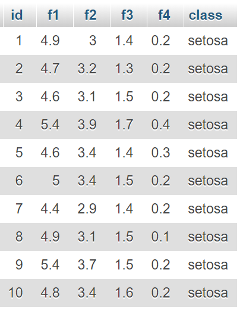
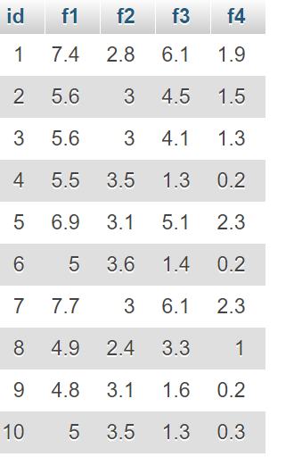
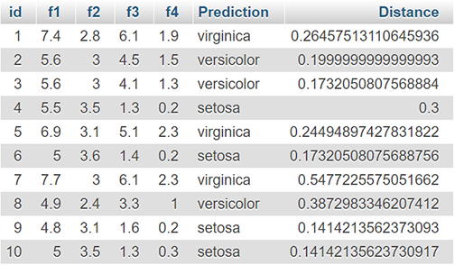

# NearestNeighborClassiferSQL
An implemenation of the Nearest Neighbor classifier in SQL.

Two tables are necessary.
Load data into the 'trainingset' table and 'testset' table. Or run 'Create trainingdata.sql' and 'Create testdata.sql' to use dummy data.

Example of trainingset

Example of testset

Run 'Nearest neighbor.sql"

Example of output

