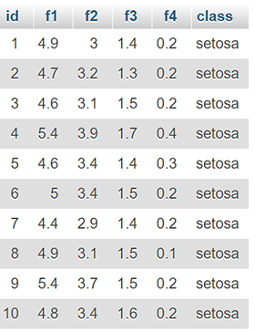
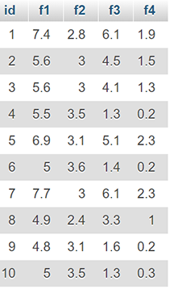

# NearestNeighborClassiferSQL
An implementation of the Nearest Neighbor classifier with the Euclidean distance as the distance metric in SQL.

Load data into the 'trainingset' table and the 'testset' table. Or run 'Create trainingdata.sql' and 'Create testdata.sql' to use dummy data.

*Example of trainingset (partial)* 

*Example of testset (partial)* 

Run 'Nearest neighbor.sql"

*Example of output* 

